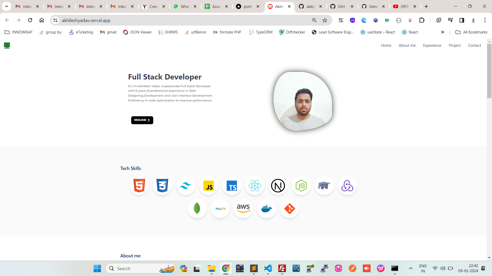

# Personal Portfolio

Welcome to my personal portfolio! This repository showcases my projects, skills, and experiences. Feel free to explore and get to know more about me.

## Table of Contents

- [About](#about)
- [Projects](#projects)
- [Skills](#skills)
- [Contact](#contact)

## About

I'm Akhilesh Yadav, a Frontend Developer with a passion for Web development. This portfolio highlights my journey, projects, and skills in the field of Web development. Through my work, I aim to [Your Mission or Objective].

## Projects

### Project 1: Threads-clone

- Description: "Threads Clone is a project that aims to replicate the core functionalities and features of the popular communication and messaging app called 'Threads.' Similar to the original Threads app, the clone project likely focuses on providing users with a platform for private and close-circle communication.",
- Technologies Used: "React",
  "Nextjs",
  "TypeScript",
  "Tailwind",
  "Redux",
  "MongoDB",
- Demo: "https://threads-akkiyadav143.vercel.app/"

- Tech Skills: HTML5 | CSS3 | Bootstrap | JavaScript | TypeScript | React.js | Next.js | Redux | MongoDB | Git |

## Contact

Feel free to reach out to me:

- Email: akkiyadav143@gmail.com
- LinkedIn: https://www.linkedin.com/in/akhilesh-yadav-39866184/

Thank you for visiting my portfolio!
